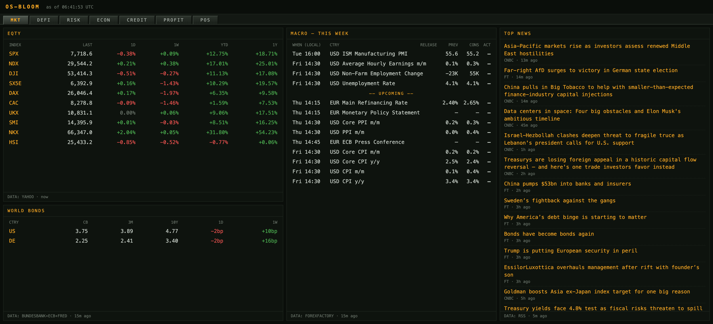
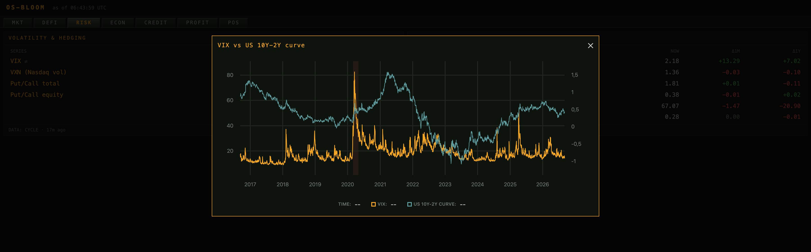

# os-bloom

Customized fork of the upstream self-hosted macro and markets terminal, with
mobile/PWA support and automated anomaly/trend digesting.

<div align="center">

**A self-hosted macro and markets terminal that runs entirely on free data
sources — built AI-first.**

No Bloomberg seat, no paid vendors, no brokerage account —
one free FRED API key is the only credential you need.

Written largely by AI agents, directed and reviewed by a human. That is the
point rather than a disclaimer: os-bloom is both a working terminal and an
experiment in how far AI-assisted development carries a real system — one with
live upstreams, awkward data, and decisions that have to be defended.

[](LICENSE)




</div>

---

It collects ~60 series on a schedule into a local SQLite file and serves them
as a dense, keyboard-driven terminal UI: macro calendar, world equity indexes,
government bond yields and policy rates, headlines, DeFi yields, and a
five-tab market-cycle chart pack.

This fork also generates an automated digest from the collected data:

- anomaly alerts based on unusually large moves versus recent history
- cross-series trend summaries using rolling 1M moves
- a newsletter-style panel/API payload covering macro, news, DeFi, and rates
- installable mobile/PWA support with browser notifications for fresh digests

## Tabs

Press `1`–`7`, or use `#/mkt`-style URL fragments.

| Tab | Contents |
| --- | --- |
| **MKT** | Macro release calendar (past 7 days + upcoming), 10 world equity indexes, a bond matrix (10Y / 3M / central bank rate, for the US and Germany), and top headlines. Every row opens a click-through chart. |
| **DEFI** | Zyfai decentralized-finance USDC yield tiers, Morpho Midnight fixed-term structure with a hover-readout curve, Morpho markets, and a RATE REFS panel (Aave, Pendle implied APY, BTC perp funding) with history charts. |
| **RISK** | Volatility and hedging (VIX, VXN, put/call), sentiment and rotation (AAII spread, cyclicals/defensives, small/large, gold/silver). |
| **ECON** | ISM PMIs, OECD leading indicators, jobless claims, JOLTS, heavy truck sales, UMich sentiment, M2, breakevens, real rates, dollar index. |
| **CREDIT** | Yield curves (10Y-3M, 10Y-2Y), IG/HY/BBB/CCC option-adjusted spreads, the Chicago Fed NFCI, and bank lending growth. |
| **PROFIT** | Corporate profits growth. |
| **POS** | CFTC Commitments of Traders net non-commercial positioning (VIX, crude, USD index, GBP). |

The 39 market-cycle series across RISK/ECON/CREDIT/PROFIT/POS refresh daily.

## Every row opens a chart

Click any series and it opens over the dashboard with ten years of history,
NBER recession shading, and an optional second series on a right-hand axis
(marked `⇄` in the tables).

<div align="center">

</div>

## Quickstart

You need Docker and a free [FRED API key](https://fred.stlouisfed.org/docs/api/api_key.html)
(instant, email only).

```bash
git clone https://github.com/Gametheory1991/os-bloom.git && cd os-bloom
cp .env.example .env        # then set FRED_API_KEY
docker compose up --build
```

Open <http://localhost:8080>. Panels fill in as the scheduler's first fetches
land — most within a minute, the daily cycle job on its first tick.

Port 8080 already taken? Set `UI_PORT`:

```bash
UI_PORT=9090 docker compose up --build
```

`GET /healthz` reports, per fetcher, its last run, the source actually used,
and any error. `GET /api/insights` returns the current automated digest.

<details>
<summary><b>Running without Docker</b></summary>

```bash
cd collector
python3 -m venv .venv && .venv/bin/pip install -e '.[dev]'
cd .. && set -a && . ./.env && set +a
cd collector && SERVE_UI=1 CONFIG_PATH=../config.yaml .venv/bin/python -m collector.main
```

Serves UI and API together on <http://localhost:8000>.

</details>

## Data sources

Everything below is free. Only FRED requires registration; everything else is
keyless.

| Source | Provides | Key |
| --- | --- | :---: |
| [FRED](https://fred.stlouisfed.org/) | US/EZ macro series, Treasury yields, credit spreads, NFCI, recession bands | free key |
| [DBnomics](https://db.nomics.world/) | ISM manufacturing + services PMI | — |
| [OECD SDMX](https://sdmx.oecd.org/) | Composite leading indicators (US, G4E) | — |
| [CFTC](https://publicreporting.cftc.gov/) | Commitments of Traders positioning | — |
| [CBOE](https://www.cboe.com/) | Daily total + equity put/call ratios | — |
| [AAII](https://www.aaii.com/sentimentsurvey) | Bull-bear sentiment spread (legacy `.xls`) | — |
| [Yahoo Finance](https://finance.yahoo.com/) | Equity index closes and ratio series | — |
| [ECB Data Portal](https://data.ecb.europa.eu/) | Euro-area AAA yield curve (3M) | — |
| [Bundesbank](https://www.bundesbank.de/) | German 10Y benchmark | — |
| ForexFactory mirror | Macro release calendar | — |
| FT, CNBC, MarketWatch, ECB, Fed | Headlines, via public RSS | — |
| [Morpho](https://morpho.org/) | Morpho Blue markets, Midnight fixed-term book | — |
| [Pendle](https://www.pendle.finance/) | Implied APY and expiry | — |
| [Binance](https://www.binance.com/) | BTC perpetual funding rate | — |
| [DefiLlama](https://defillama.com/) | APY history backfill | — |
| [Zyfai](https://zyf.ai/) | USDC opportunity tiers | — |
| Public RPCs (Base, Ethereum, Arbitrum) | Aave reserve data, read-only `eth_call` | — |

## Development

```bash
make test    # 189 passing, 1 skipped
make run
make smoke
```
